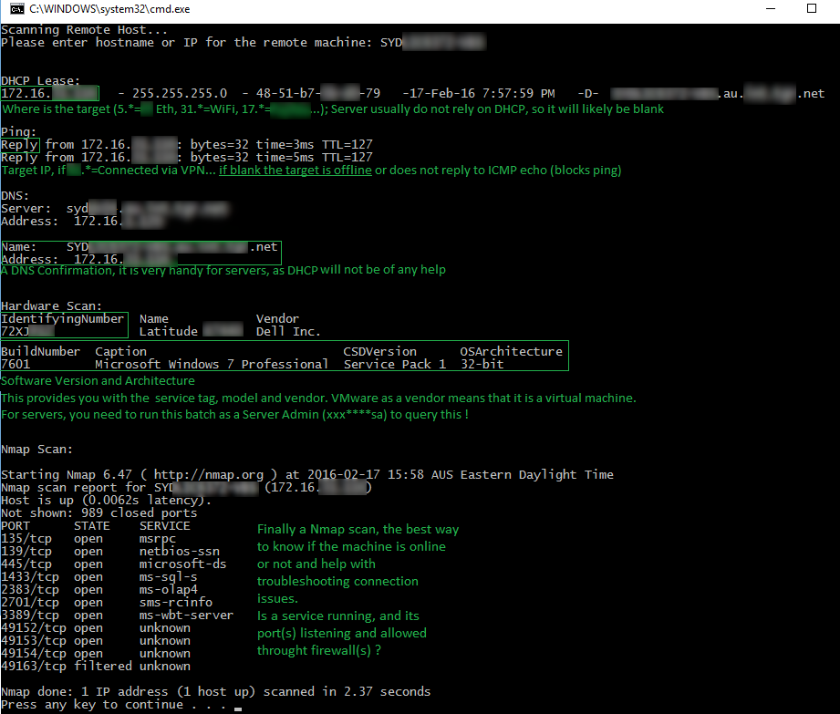

 # Remote Machine Information Gathering Script

This script is designed for SysAdmins to gather comprehensive information about a remote machine within a local network. Whether it's a client (workstation) or server, this script prompts the user to enter the hostname or IP address of the remote machine and then performs several tasks:

- Pinging (ICMP) the machine to check reachability
- Querying DHCP leases to find the machine's DHCP records
- Resolving DNS names and addresses
- Retrieving hardware information using WMI
- Scanning the operating system details
- Identifying connected users
- Optionally performing an Nmap scan if Nmap is installed

The script loops, allowing the user to scan multiple machines sequentially.

## Requirements

- **Operating Systems**: Tested on Microsoft Windows 7, 8.1, 10
- **Software**: Nmap and RSAT (Remote Server Administration Tools)
- **Credentials**: Domain & Workstation Admin credentials

## Usage

1. **Set the Domain Controller and DHCP Ranges**:
   - Open the script and set the domain controller IP or FQDN.
   - Set the DHCP ranges for your network.

2. **Run the Script**:
   - Open a Command Prompt with administrative privileges.
   - Navigate to the directory containing the script.
   - Run the script by typing `script_name.bat` and pressing Enter.

3. **Enter the Hostname or IP Address**:
   - When prompted, enter the hostname or IP address of the remote machine you want to scan.

4. **Review the Output**:
   - The script will perform the tasks mentioned above and display the results in the Command Prompt.

## Screenshot

